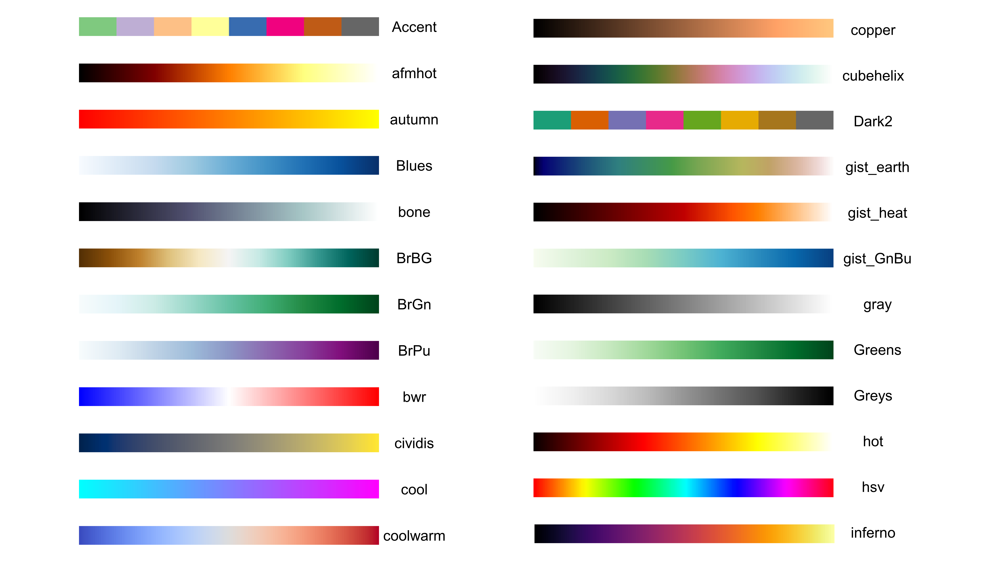
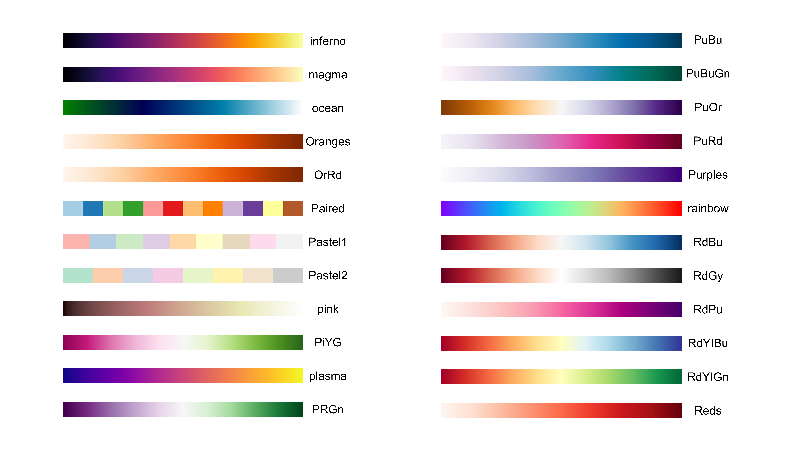
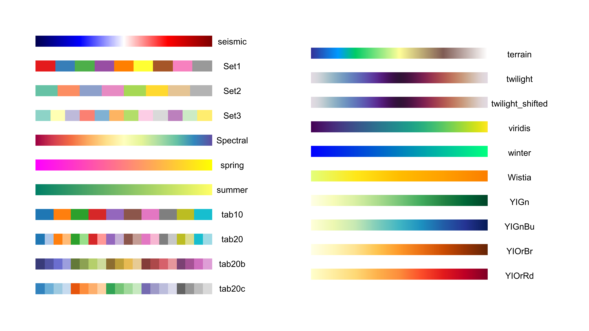
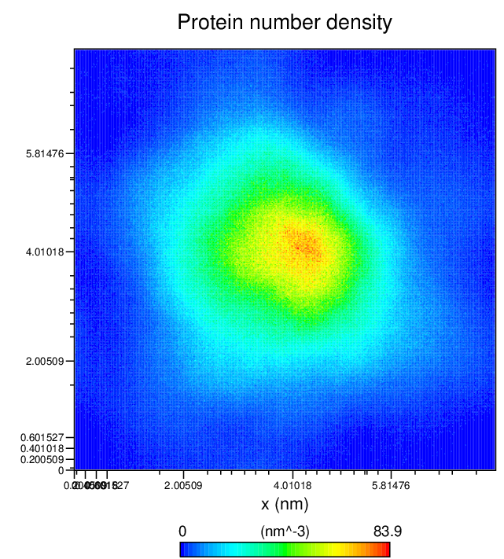
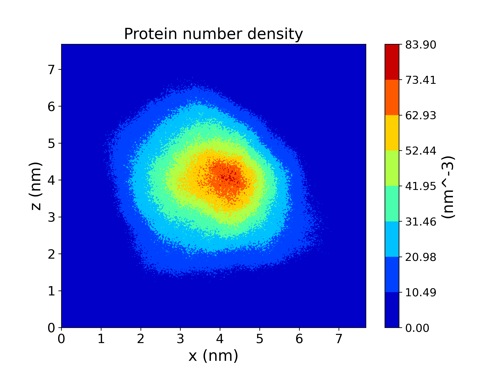
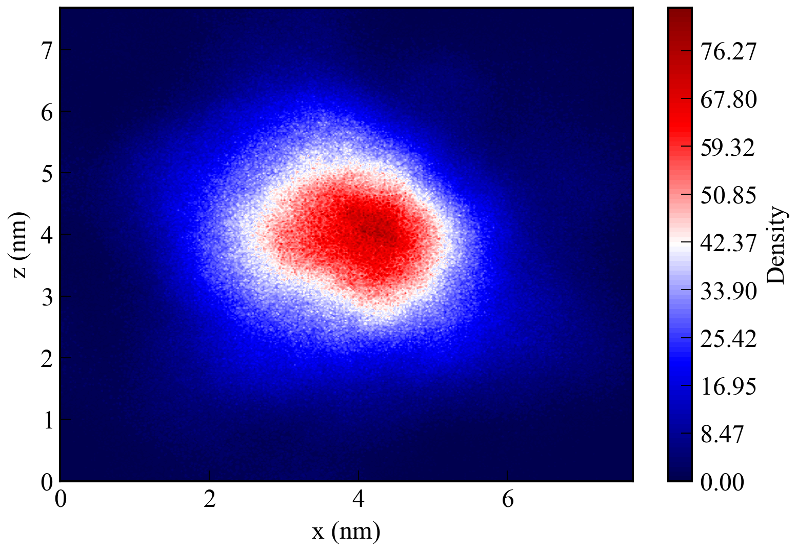

`drawXPM`是用于绘制由GROMACS中`densmap`命令得到的`xpm`文件的工具。相较于其他的同类型`xpm`文件绘图工具，`drawXPM`有着灵活、便捷的特点，无需绘图者有任何编程基础，点开`drawXPM`的可执行文件即可作图。

### 使用方法
#### 基本操作
目录下的`DrawXPM.py`为`DrawXPM`软件的python源代码。`drawXPM.exe`为其的可执行文件。双击`drawXPM.exe`就可以运行该软件。运行该软件后，首先会看到以下的内容：
```
Draw filled contours from xpm file by gmx densmap.
Version 1.0, release date: 2024-Jun-25
Programmed by Jian Zhang (jian_zhang@cug.edu.cn)

Please enter the path to your xpm file
```
随后，直接将需要绘图的`xpm`文件拉进软件，然后会出现以下的内容：
```
 0  x_label: x (nm)
 1  y_label: z (nm)
 2  style of colorbar: jet
 3  alpha: 1
 4  the number of color in colorbar: 100
 5  Whether to turn on coordinate scale: False
 6  dpi: 300
 7  style file: ./style/no-latex.mplstyle, ./style/my.mplstyle
 8  the label of colorbar: Density
 9  Whether to display the color bar scale: False
10  the range of values: (0, 1)
 d  start to draw
```
* 按`0`：修改图像的`x`轴坐标名称，默认值从`xpm`文件中读取
* 按`1`：修改图像的`y`轴坐标名称，默认值从`xpm`文件中读取
* 按`2`：修改色彩条样式，默认为`jet`样式
* 按`3`：修改图像的透明度(值域为0至1)，默认为`1`
* 按`4`：修改色彩条上颜色的个数，该值越大颜色的色彩变化越平滑，默认为`100`
* 按`5`：是否显示`x`轴和`y`轴坐标名称，默认为不显示
* 按`6`：生成图像的分辨率，默认为`300`
* 按`7`：设置作图格式文件路径，默认为`./style/no-latex.mplstyle`和`./style/my.mplstyle`
* 按`8`：设置色彩条标签，默认为`Density`
* 按`9`：是否显示色彩条刻度，默认不显示
* 按`10`：设置色彩条的值域
* 按`d`：开始作图

#### 色彩条样式的修改
色彩条样式可支持以下的样式。
<div style="margin: auto"></div>
<div style="margin: auto"></div>
<div style="margin: auto"></div>
关于色彩条样式的详细情况，请访问<a href="https://matplotlib.org/stable/users/explain/colors/colormaps.html" target="_blank">Choosing Colormaps in Matplotlib</a>

### 绘图效果
* 采用gmx自带的xpm2ps命令作图
  <div style="text-align:center;">
    
  </div>
* 采用<a href="http://bbs.keinsci.com/thread-20056-1-1.html" target="_blank">plot_xpm</a>作图
  <div style="text-align:center;">
    
  </div>
* 采用DrawXPM作图
  <div style="text-align:center;">
    
  </div>

### 更新日志
* [2024-Jul-16] 增加菜单中`10`选项，能够使用户自己选择色彩条值域。

### 鸣谢
在开发`DrawXPM`的过程中，主要使用到了以下的Python开源模组
* NumPy, https://numpy.org/
* Matplotlib, https://matplotlib.org/
* PyInstaller, https://pyinstaller.org/en/stable/

此外，还参考了以下Python脚本或开源模组的处理方式
* GromacsWrapper, https://gromacswrapper.readthedocs.io/en/latest/
* SciencePlots, https://github.com/garrettj403/SciencePlots
* plot_xpm, http://bbs.keinsci.com/thread-20056-1-1.html

在此，对上述模组或脚本的开发者表示感谢。

### 许可证
`DrawXPM`基于MIT许可证开源。这意味着您可以自由地使用，修改和分发代码。

